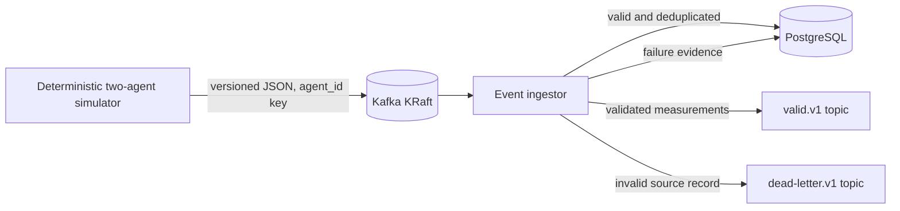

# NetPulse

NetPulse is a production-inspired, multi-agent home-network observability
prototype. It compares a wired reference with a fixed Wi-Fi observer so later
incident logic can distinguish probable local wireless degradation from router,
ISP, DNS, and external-service symptoms.

Phase 1 implements and tests the local ingestion foundation:



This is a small local test bed for data-engineering concepts, not an ISP-grade
monitor, a production-scale benchmark, or definitive root-cause detection.

## What works in Phase 1

- Eight explicitly configured Kafka topics on a single KRaft broker.
- Version 1 JSON Schema and Pydantic contracts with additive-field compatibility.
- Seeded wired/wireless scenarios, malformed and duplicate records, late events,
  clock drift, outage symptoms, and burst generation.
- Manual-offset consumption, durable PostgreSQL writes, required output
  acknowledgements, replay-safe `event_id` upserts, and dead-letter evidence.
- Docker Compose, Alembic migrations, structured logs, CI, unit/contract tests,
  a live integration test, and stack verification.

Spark, real Raspberry Pi collectors, local SQLite buffering, incident
classification, dashboards, query APIs, Kubernetes, and measured capacity
results are intentionally not implemented yet.

## Quick start

Requirements:

- Docker Desktop or Docker Engine with Compose v2
- Approximately 4 GB of available memory
- PowerShell 7/Windows PowerShell or a POSIX shell

PowerShell:

```powershell
Copy-Item .env.example .env
./scripts/netpulse.ps1 setup
./scripts/netpulse.ps1 up
./scripts/netpulse.ps1 demo
./scripts/netpulse.ps1 verify
```

POSIX shell:

```bash
cp .env.example .env
./scripts/netpulse.sh setup
./scripts/netpulse.sh up
./scripts/netpulse.sh demo
./scripts/netpulse.sh verify
```

Change both passwords in `.env` before using the stack on a shared machine.
Host ports bind only to loopback. The default examples contain fabricated
identifiers.

## Common commands

| Action | Make | PowerShell |
|---|---|---|
| Validate Compose | `make config` | `./scripts/netpulse.ps1 config` |
| Build/start core | `make up` | `./scripts/netpulse.ps1 up` |
| Run unit and contract tests | `make test` | `./scripts/netpulse.ps1 test` |
| Run live integration tests | `make test-integration` | `./scripts/netpulse.ps1 test-integration` |
| Run deterministic demo | `make demo` | `./scripts/netpulse.ps1 demo` |
| Verify stored invariants | `make verify` | `./scripts/netpulse.ps1 verify` |
| Inspect topics | `make kafka-topics` | `./scripts/netpulse.ps1 kafka-topics` |
| Open PostgreSQL shell | `make db-shell` | `./scripts/netpulse.ps1 db-shell` |
| Stop containers | `make down` | `./scripts/netpulse.ps1 down` |

`reset` additionally deletes the named Kafka and PostgreSQL volumes and is
therefore destructive to local demo data.

## Simulator examples

```bash
docker compose --profile demo run --rm simulator \
  run --scenario wifi-degradation --duration 30 --seed 42

docker compose --profile demo run --rm simulator \
  run --scenario isp-outage --duration 20

docker compose --profile demo run --rm simulator \
  load-test --rate 100 --duration 30
```

Scenario data is reproducible for a fixed seed and event timestamp. The
`kafka-disconnection` scenario supplies deterministic traffic for the failure
runbook; an actual broker stop is required to create a real disconnection.

## Delivery semantics

The ingestor persists a valid record before publishing required downstream
output and commits the input offset only after both operations succeed.
Invalid input is stored in `processing_failures`, published to the dead-letter
topic, marked as published, and only then committed.

A crash between these steps can replay work. PostgreSQL deduplicates by
`event_id` and source coordinates, but downstream Kafka output can repeat.
NetPulse therefore promises at-least-once delivery, not end-to-end exactly once.

## Documentation

- [Architecture](docs/architecture.md)
- [Data contracts](docs/data-contracts.md)
- [Local deployment](docs/deployment.md)
- [Failure testing](docs/failure-testing.md)
- [Security and privacy](docs/security.md)
- [Troubleshooting](docs/troubleshooting.md)
- [Known limitations](docs/limitations.md)
- [Roadmap](docs/roadmap.md)
- [Initial repository assessment](docs/repository-assessment.md)
- [Phase 1 completion report](docs/phase1-completion-report.md)

## Portfolio description

**Home Network Reliability Observatory — Personal Data Engineering Project**

- Built a Dockerized two-agent telemetry ingestion prototype using Python,
  Apache Kafka in KRaft mode, PostgreSQL, versioned data contracts, dead-letter
  routing, and replay-safe database writes.
- Added deterministic network-failure scenarios and automated tests for schema
  compatibility, invalid-event evidence, and event-ID deduplication.

Only completed Phase 1 capabilities are claimed here. See the roadmap before
using broader project-description language.

## License

MIT
