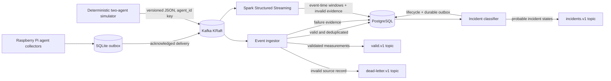

# NetPulse

NetPulse is a production-inspired, multi-agent home-network observability
prototype. It compares a wired reference with a fixed Wi-Fi observer so later
incident logic distinguishes probable local wireless degradation from router,
ISP, DNS, and external-service symptoms.

Phase 1 implements the validated local ingestion foundation. Phase 2 adds the
lightweight agent software and its durable local queue. Phase 3 adds event-time
streaming curation. Phase 4 adds deterministic incident correlation:



This is a small local test bed for data-engineering concepts, not an ISP-grade
monitor, a production-scale benchmark, or definitive root-cause detection.

## What works

- Eight explicitly configured Kafka topics on a single KRaft broker.
- Version 1 JSON Schema and Pydantic contracts with additive-field compatibility.
- Seeded wired/wireless scenarios, malformed and duplicate records, late events,
  clock drift, outage symptoms, and burst generation.
- Manual-offset consumption, durable PostgreSQL writes, required output
  acknowledgements, replay-safe `event_id` upserts, and dead-letter evidence.
- Docker Compose, Alembic migrations, structured logs, CI, unit/contract tests,
  a live integration test, and stack verification.
- Configurable ping, DNS, bounded HTTP, Wi-Fi, heartbeat, and opt-in speed-test
  collectors suitable for headless Raspberry Pi OS.
- A size-bounded SQLite outbox that preserves event time, retries with bounded
  exponential backoff, and marks delivery only after Kafka acknowledgement.
- SSID/BSSID omission or hashing, target-address omission, systemd service
  assets, and mock-based hardware/error tests.
- Spark 4.1.2 raw-measurement parsing, a 15-minute watermark, 1/5/15-minute and
  daily windows, approximate percentiles, persistent checkpoints, structured
  progress logs, replay-safe PostgreSQL aggregates, and invalid source evidence.
- Deterministic cross-agent rules for Wi-Fi, router, ISP, DNS, service, latency,
  loss, and agent-offline symptoms, with confidence, evidence, lifecycle state,
  PostgreSQL persistence, and an acknowledgement-gated Kafka outbox.

Physical Pi Zero W/Pi 3 installation and resource measurements have not been
executed. Dashboards, query APIs, Kubernetes, and measured capacity results are
intentionally not implemented yet.

## Quick start

Requirements:

- Docker Desktop or Docker Engine with Compose v2
- Approximately 4 GB of available memory
- PowerShell 7/Windows PowerShell or a POSIX shell

PowerShell:

```powershell
Copy-Item .env.example .env
./scripts/netpulse.ps1 setup
./scripts/netpulse.ps1 up
./scripts/netpulse.ps1 demo
./scripts/netpulse.ps1 verify
```

POSIX shell:

```bash
cp .env.example .env
./scripts/netpulse.sh setup
./scripts/netpulse.sh up
./scripts/netpulse.sh demo
./scripts/netpulse.sh verify
```

Change both passwords in `.env` before using the stack on a shared machine.
Host ports bind only to loopback. The default examples contain fabricated
identifiers.

## Common commands

| Action | Make | PowerShell |
|---|---|---|
| Validate Compose | `make config` | `./scripts/netpulse.ps1 config` |
| Build/start core | `make up` | `./scripts/netpulse.ps1 up` |
| Run unit and contract tests | `make test` | `./scripts/netpulse.ps1 test` |
| Run live integration tests | `make test-integration` | `./scripts/netpulse.ps1 test-integration` |
| Run deterministic demo | `make demo` | `./scripts/netpulse.ps1 demo` |
| Verify stored invariants | `make verify` | `./scripts/netpulse.ps1 verify` |
| Inspect topics | `make kafka-topics` | `./scripts/netpulse.ps1 kafka-topics` |
| Open PostgreSQL shell | `make db-shell` | `./scripts/netpulse.ps1 db-shell` |
| Build the agent image | `make agent-build` | `./scripts/netpulse.ps1 agent-build` |
| Validate sample agent config | `make agent-validate` | `./scripts/netpulse.ps1 agent-validate` |
| Run agent tests | `make agent-test` | `./scripts/netpulse.ps1 agent-test` |
| Build Spark processor | `make stream-build` | `./scripts/netpulse.ps1 stream-build` |
| Run Spark continuously | `make stream-run` | `./scripts/netpulse.ps1 stream-run` |
| Process available Kafka data | `make stream-once` | `./scripts/netpulse.ps1 stream-once` |
| Verify streaming invariants | `make stream-verify` | `./scripts/netpulse.ps1 stream-verify` |
| Build incident classifier | `make classifier-build` | `./scripts/netpulse.ps1 classifier-build` |
| Run incident classifier | `make classifier-run` | `./scripts/netpulse.ps1 classifier-run` |
| Evaluate incidents once | `make classifier-once` | `./scripts/netpulse.ps1 classifier-once` |
| Verify incident lifecycle | `make classifier-verify` | `./scripts/netpulse.ps1 classifier-verify` |
| Stop containers | `make down` | `./scripts/netpulse.ps1 down` |

`reset` additionally deletes the named Kafka and PostgreSQL volumes and is
therefore destructive to local demo data.

## Simulator examples

```bash
docker compose --profile demo run --rm simulator \
  run --scenario wifi-degradation --duration 30 --seed 42

docker compose --profile demo run --rm simulator \
  run --scenario isp-outage --duration 20

docker compose --profile demo run --rm simulator \
  load-test --rate 100 --duration 30
```

Scenario data is reproducible for a fixed seed and event timestamp. The
`kafka-disconnection` scenario supplies deterministic traffic for the failure
runbook; an actual broker stop is required to create a real disconnection.

## Delivery semantics

The ingestor persists a valid record before publishing required downstream
output and commits the input offset only after both operations succeed.
Invalid input is stored in `processing_failures`, published to the dead-letter
topic, marked as published, and only then committed.

A crash between these steps can replay work. PostgreSQL deduplicates by
`event_id` and source coordinates, but downstream Kafka output can repeat.
NetPulse therefore promises at-least-once delivery, not end-to-end exactly once.

The agent first stores every event in SQLite. Kafka callback success marks it
delivered; failure leaves it queued with retry metadata. Collection continues
on separate worker threads while Kafka is unavailable.

Spark separately consumes raw measurements with persistent checkpoints.
Curated window rows and rejected source coordinates use PostgreSQL conflict
keys, but Kafka, Spark state, and PostgreSQL do not share an atomic transaction.
This remains replay-safe at-least-once processing rather than an end-to-end
exactly-once claim.

The classifier first commits each lifecycle state and its Kafka payload to a
PostgreSQL outbox. It marks the outbox row published only after Kafka
acknowledges `network.incidents.v1`. A crash can repeat a stable `event_id`;
incident consumers must deduplicate it.

## Documentation

- [Architecture](docs/architecture.md)
- [Data contracts](docs/data-contracts.md)
- [Local deployment](docs/deployment.md)
- [Raspberry Pi setup](docs/raspberry-pi-setup.md)
- [Spark Structured Streaming](docs/streaming.md)
- [Incident classification](docs/incident-classification.md)
- [Failure testing](docs/failure-testing.md)
- [Security and privacy](docs/security.md)
- [Troubleshooting](docs/troubleshooting.md)
- [Known limitations](docs/limitations.md)
- [Roadmap](docs/roadmap.md)
- [Initial repository assessment](docs/repository-assessment.md)
- [Phase 1 completion report](docs/phase1-completion-report.md)
- [Phase 2 implementation checklist](docs/phase2-implementation-plan.md)
- [Phase 2 software completion report](docs/phase2-completion-report.md)
- [Phase 3 implementation checklist](docs/phase3-implementation-plan.md)
- [Phase 3 completion report](docs/phase3-completion-report.md)
- [Phase 4 implementation checklist](docs/phase4-implementation-plan.md)
- [Phase 4 completion report](docs/phase4-completion-report.md)

## Portfolio description

**Home Network Reliability Observatory — Personal Data Engineering Project**

- Built a Dockerized two-agent telemetry ingestion prototype using Python,
  Apache Kafka in KRaft mode, PostgreSQL, versioned data contracts, dead-letter
  routing, and replay-safe database writes.
- Added deterministic network-failure scenarios and automated tests for schema
  compatibility, invalid-event evidence, and event-ID deduplication.
- Implemented a configurable headless measurement agent with privacy controls,
  mockable Linux collectors, and an acknowledgement-gated SQLite outbox.
- Built a Spark Structured Streaming curation path with event-time watermarks,
  four aggregate windows, checkpoint recovery, invalid-record evidence, and
  replay-safe PostgreSQL upserts.
- Implemented evidence-bearing deterministic correlation and a replay-safe
  candidate-to-resolved incident lifecycle published through Kafka.

Only capabilities supported by the completion reports are claimed here;
physical Raspberry Pi validation remains outstanding.

## License

MIT
