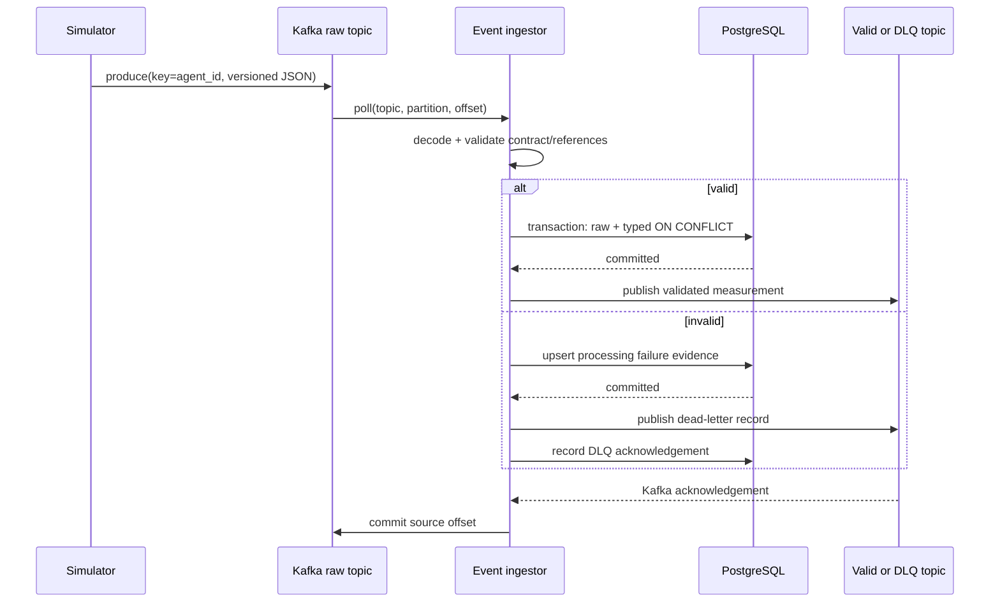
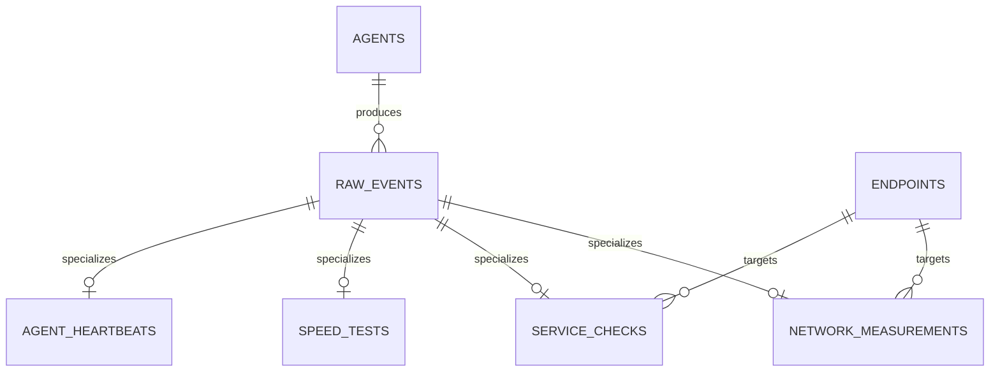

# Phase 1 architecture

## Components

- The simulator models fabricated wired and Wi-Fi agents. It validates every
  normal event before publication and keys Kafka records by `agent_id`.
- Kafka runs as one local KRaft broker. Topic creation is explicit and
  idempotent; auto-creation is disabled.
- The event ingestor validates untrusted records, checks configured agent and
  endpoint references, persists operational data, publishes validated
  measurements or dead letters, and manually commits source offsets.
- PostgreSQL retains a JSONB copy of valid input plus typed operational tables.
  Alembic owns schema evolution.

If processing fails, the consumer seeks to the same offset and retries with
bounded exponential backoff and jitter. After the configured attempt limit it
stops without committing, allowing an operator to repair the dependency and
restart from the failed offset.

## Kafka topics

All local topics use three partitions, replication factor one, delete cleanup,
and `agent_id` keys where the source has an agent. Ordering is guaranteed only
within one key/partition.

| Topic | Purpose | Retention |
|---|---|---:|
| `network.measurements.raw.v1` | Untrusted ping/Wi-Fi input | 7 days |
| `network.measurements.valid.v1` | Validated measurement output | 7 days |
| `network.service-checks.raw.v1` | DNS/HTTP input | 7 days |
| `network.speed-tests.raw.v1` | Low-frequency throughput input | 30 days |
| `network.agent-heartbeats.v1` | Agent runtime metadata | 7 days |
| `network.incidents.v1` | Reserved for Phase 4 incidents | 30 days |
| `network.dead-letter.v1` | Invalid input with source coordinates | 30 days |
| `network.processing-metrics.v1` | Reserved for pipeline metrics | 7 days |

The ingestor group is `netpulse-ingestion-v1`. Replays use a new explicit
consumer group or reset this group’s offsets after confirming downstream
deduplication behavior.

## Operational database

`raw_events` is the durable compatibility record and has unique constraints on
both `event_id` and source topic/partition/offset. Typed tables use `event_id`
as a primary and foreign key:

`processing_failures` stores original bytes, validation details, attempts, and
dead-letter publication time. It deliberately remains separate from valid raw
events.

## Reliability boundary

Kafka and PostgreSQL do not participate in one atomic transaction. A replay
after database commit can republish validated output. Database writes are
idempotent; future Spark and classifier consumers must deduplicate `event_id`.
Producer idempotence reduces duplicate retries within one producer session but
does not change the end-to-end guarantee.
