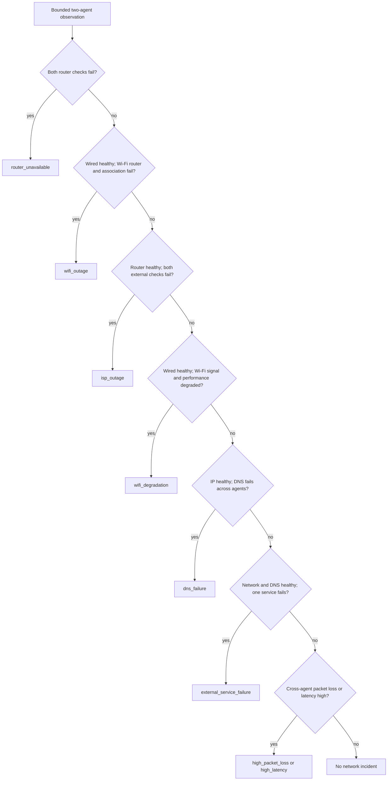
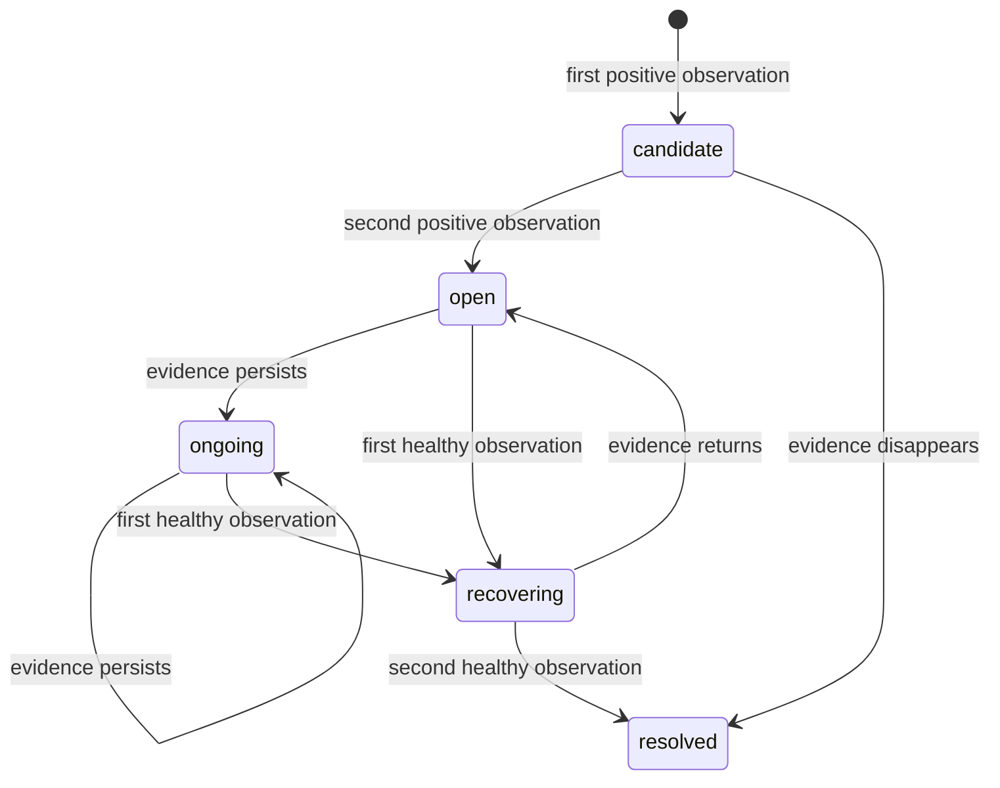

# Deterministic incident classification

## Scope

The Phase 4 classifier compares bounded observations from the wired reference
and Wi-Fi observer. It reports a probable classification with evidence and a
confidence score. It cannot inspect the router, modem, ISP, resolver, or remote
service internally and therefore does not claim definitive root cause.

The service reads typed operational rows from PostgreSQL. This lets it correlate
network measurements, DNS/HTTP checks, and heartbeat freshness without joining
independent Kafka partitions by processing time. The default lookback is 60
seconds and each grouped observation needs at least two samples.

## Rule order

Rules are deterministic and evaluated from the most specific correlated outage
to broader symptoms:

Heartbeat staleness is evaluated independently. An agent is `agent_offline`
only when its heartbeat is stale and another enabled agent remains current.

Default thresholds are configurable through environment variables:

| Setting | Default |
|---|---:|
| Lookback | 60 seconds |
| Minimum samples per group | 2 |
| Healthy success rate | at least 80% |
| Failed success rate | at most 20% |
| High latency | 150 ms |
| High packet loss | 20% |
| Weak Wi-Fi signal | -78 dBm or lower |
| Heartbeat stale age | 150 seconds |

A single failed ping cannot satisfy the sample gate. Structurally valid high
latency and packet loss remain telemetry; classification does not route them to
the dead-letter path.

## Lifecycle

Each transition has a stable incident ID, increasing state revision, supporting
evidence, affected agents/endpoints, a bounded confidence score, and a probable
diagnostic action. A resolved recurrence creates a new incident instance.

## Persistence and delivery

`network_incidents` stores current and historical lifecycle state.
`incident_state_events` is a durable PostgreSQL outbox with one row per incident
revision. The classifier:

1. republishes any unacknowledged outbox rows;
2. loads a bounded observation snapshot and active incidents;
3. commits lifecycle transitions and their serialized contract payloads;
4. publishes each row to `network.incidents.v1`, keyed by `incident_id`;
5. marks a row published only after the Kafka delivery callback succeeds.

PostgreSQL and Kafka do not share a transaction. A crash after Kafka accepts a
record but before `published_at` is stored can republish the same `event_id`.
Downstream consumers must deduplicate incident events.

## Commands

Use `classifier-run` for periodic evaluation, `classifier-once` for one bounded
cycle, and `classifier-verify` for the seeded Wi-Fi degradation and recovery
acceptance path. PowerShell and Make/POSIX equivalents are listed in the README.
